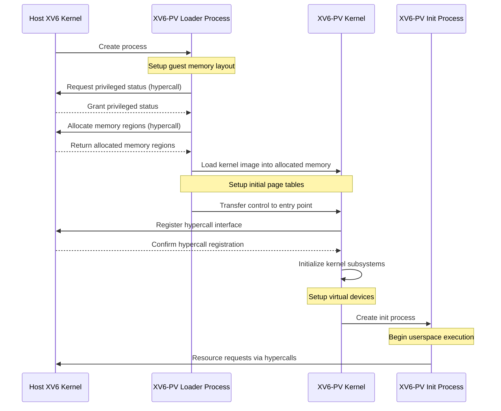
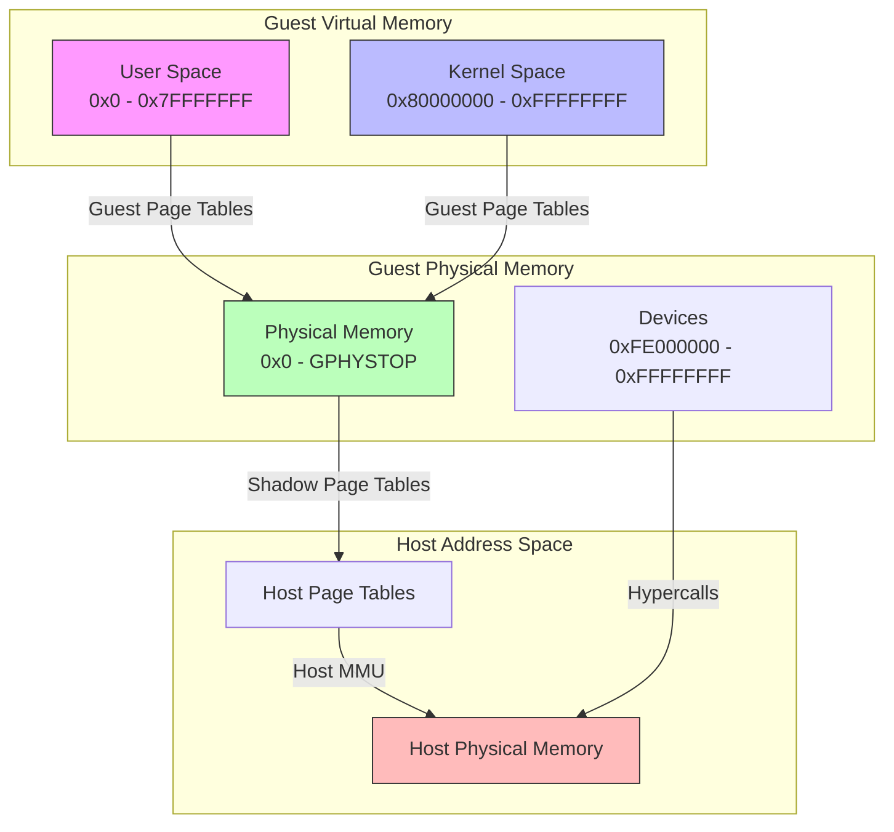
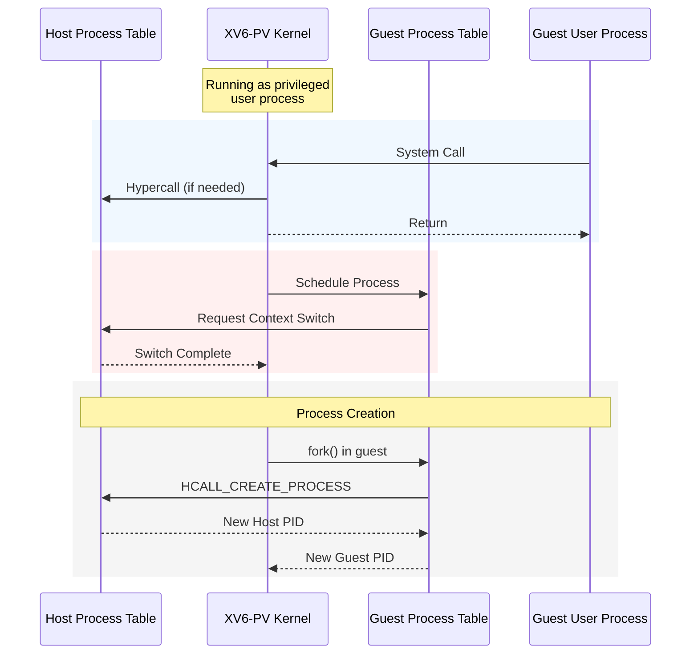
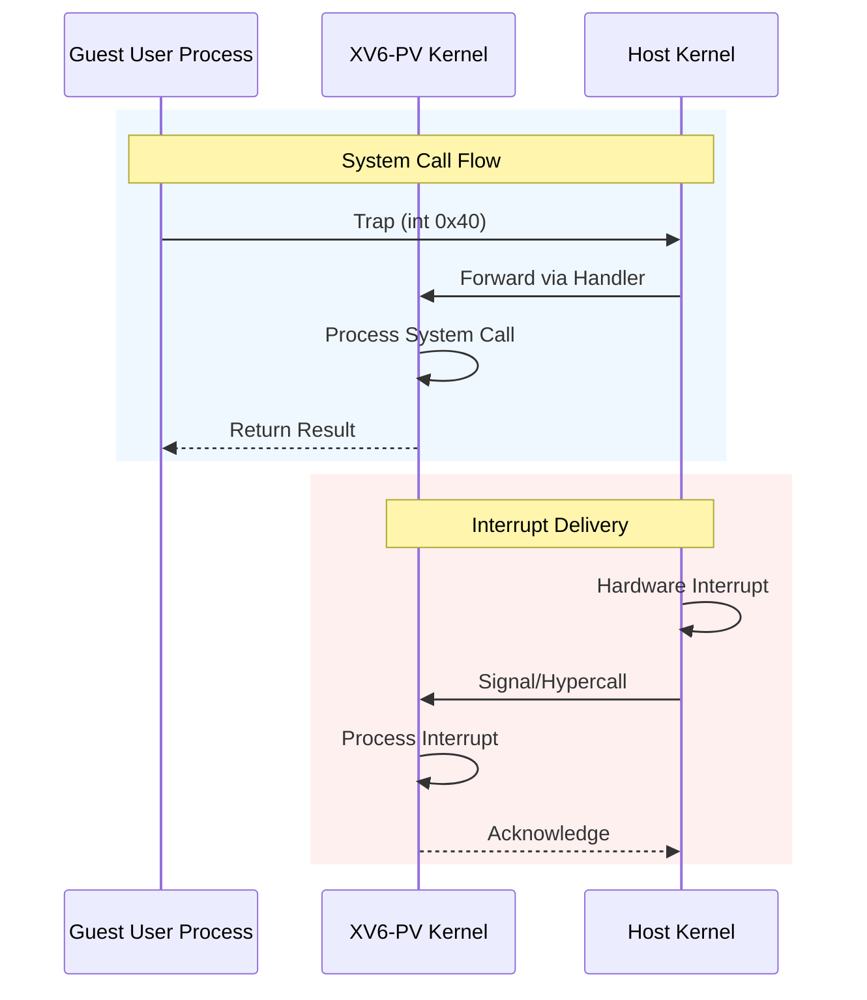
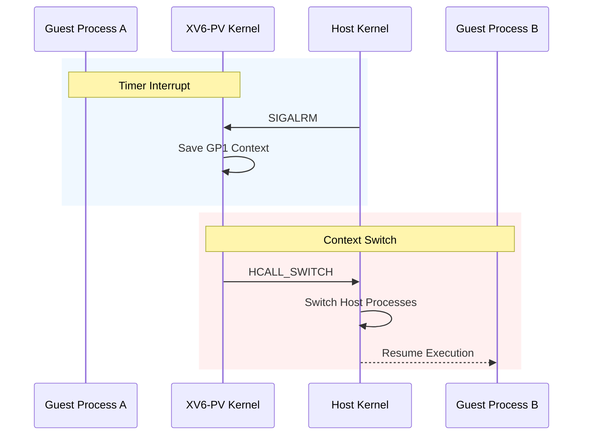
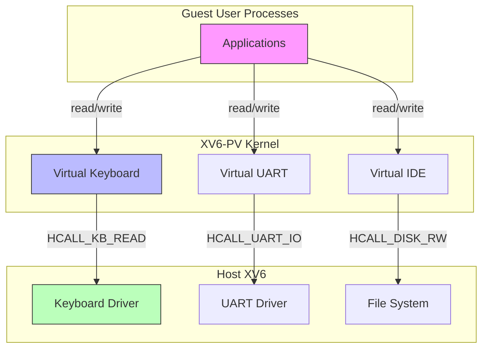

# Designing a Paravirtualized xv6 Kernel

## Introduction

Operating system paravirtualization enables direct cooperation between guest and host systems for efficient virtualization. This paper presents a design for running xv6 as a paravirtualized user process (`xv6-pv`) within another `xv6` host kernel. We detail the necessary source code modifications across core components including boot protocol, memory layout, execution environment, system calls, context switching, and device virtualization, while examining implementation tradeoffs and alternatives.

## Boot Protocol

The boot sequence for xv6-pv needs a fundamental shift from native xv6's bare-metal initialization. Rather than following the traditional BIOS-initiated boot process, xv6-pv will implement a two-stage initialization strategy using a loader process and the guest kernel, both operating as user processes within the host xv6 kernel.



</div>

The process begins with the host `xv6` kernel creating a loader process that serves as the foundation for the guest environment. This loader process, after gaining privileged status through hypercalls, handles the crucial tasks of memory allocation and environment preparation for the guest kernel.

```diff
--- a/entry.S
+++ b/entry.S
-# Multiboot header, for multiboot boot loaders like GNU Grub.
-.p2align 2
-.text
-.globl multiboot_header
-multiboot_header:
-  .long magic
-  .long flags
-  .long (-magic-flags)
+# XV6-PV guest kernel entry point
+.text
+.globl pv_entry
+pv_entry:
+    # Boot info structure passed in %ebx
+    pushl %ebx
 
-# By convention, the _start symbol specifies the ELF entry point.
-.globl _start
-_start = V2P_WO(entry)
+    # Set up initial stack (pre-allocated by loader)
+    movl $(pv_stack + PVSTACKSIZE), %esp
 
-# Entering xv6 on boot processor, with paging off.
-.globl entry
-entry:
-  # Turn on page size extension for 4Mbyte pages
-  movl    %cr4, %eax
-  orl     $(CR4_PSE), %eax
-  movl    %eax, %cr4
-  # Set page directory
-  movl    $(V2P_WO(entrypgdir)), %eax
-  movl    %eax, %cr3
+    # Initialize guest page tables
+    call setup_pv_paging
+
+    # Jump to main C code
+    call pv_main
+
+.comm pv_stack, PVSTACKSIZE
```

The modifications primarily involve removing multiboot and real-mode code, replacing physical memory management, and adding paravirtualization support through new hypercall interfaces and memory layouts.

The boot sequence completes with the creation of the initial user process (init), transitioning to normal guest execution. The guest kernel operates through hypercalls to the host for privileged operations, ensuring isolation while enabling necessary functionality. This approach mirrors modern hypervisor architectures like KVM/QEMU, though simplified for xv6's educational context.

## Memory Layout

The xv6-pv memory system will implement a two-level address translation: guest virtual addresses (GVA) to guest physical addresses (GPA), and then GPA to host virtual addresses (HVA). This shadow page table architecture will enable guest processes to maintain their isolated memory spaces while operating entirely within the host kernel's user space.



The memory subsystem will require several key components:

1. Guest Physical Memory: A contiguous block allocated by the host kernel, treated as physical memory by the guest kernel. The guest kernel will manage this region starting from address 0x0, maintaining its traditional memory layout perspective.
2. Memory Management Interface:

    ```c
    // memlayout.h modifications
    #define G_KERNBASE    0x80000000         // First kernel virtual address
    #define G_PHYSTOP     0xE000000          // Top physical memory
    #define G_DEVSPACE    0xFE000000         // Device memory mapping

    struct g_memregion {
        uint start;                         // Start of memory region
        uint size;                          // Size of region
        uint flags;                         // Access permissions
    };
    ```

3. Page Table Operations:

    ```c
    // vm.c additions
    int setup_guest_vm(pde_t *pgdir, struct g_memregion *regions);
    void *gpa_to_hva(uint gpa);            // Guest physical to host virtual
    uint hva_to_gpa(void *hva);            // Reverse translation
    ```

The memory management process will follow this sequence:

1. Guest kernel maintains its page tables mapping GVA to GPA
2. Host kernel maintains shadow page tables mapping GPA to host physical addresses
3. Memory operations requiring privileged access will be performed via hypercalls
4. Device memory access will be intercepted and emulated by the host kernel

This design preserves xv6's memory layout conventions while ensuring proper isolation through the host kernel's memory management subsystem. The shadow page table mechanism will provide the necessary translation layer between guest and host address spaces.

## Execution Environment

The xv6-pv guest kernel and its processes will operate entirely within the host kernel's user space, requiring a careful redesign of process management, context switching, and privilege handling. This execution model will implement a two-tier process hierarchy where guest processes are mapped to host processes while maintaining proper isolation.



The process structure will be extended to support guest-host process mapping:

```c
struct proc {
  // Existing xv6 fields
  uint sz;                     
  pde_t* pgdir;              
  char *kstack;              
  enum procstate state;      
  int pid;                   
  struct proc *parent;       
  struct trapframe *tf;      
  
  // New fields for paravirtualization
  int host_pid;              // Corresponding host process ID
  int is_guest_kernel;       // Flag for guest kernel process
  void *guest_context;       // Guest context for switching
  uint guest_entry;          // Guest entry point
};
```

Process creation will follow a two-step approach:

1. Guest kernel creates process structures and address spaces
2. Host kernel allocates corresponding host processes via hypercalls
3. Memory mappings are established through the shadow page table mechanism

Context switching will require coordination between guest and host schedulers:

1. Guest scheduler selects next process to run
2. Guest kernel issues hypercall to request context switch
3. Host kernel performs actual context switch between host processes
4. Control returns to guest kernel in new process context

This design preserves xv6's process model while ensuring secure operation within user-space constraints. The host kernel maintains ultimate control over resource allocation and privileged operations through the hypercall interface.

## System Calls

The paravirtualized xv6 will handle system calls and interrupts while operating in user space, requiring careful mediation through the host kernel. This design will preserve the original system call interface for guest processes while redirecting privileged operations through the host kernel.



The system call mechanism will require these modifications:

```c
// syscall.h additions
#define HCALL_SYSCALL   1
#define HCALL_INT       2

struct trap_regs {
    uint32_t eax, ebx, ecx, edx;    // General purpose registers
    uint32_t trapno;                 // Trap number
    uint32_t err;                    // Error code
};
```

Key changes to the trap handler:

```diff
--- a/trap.c
+++ b/trap.c
@@ -1,15 +1,26 @@
-struct gatedesc idt[256];
+static irq_handler_t virq_handlers[16];
 
 void
 trap(struct trapframe *tf)
 {
   if(tf->trapno == T_SYSCALL){
-    if(myproc()->killed)
-      exit();
     myproc()->tf = tf;
-    syscall();
-    if(myproc()->killed)
-      exit();
+    // Forward syscall to host
+    struct trap_regs regs;
+    regs.eax = tf->eax;
+    regs.trapno = tf->trapno;
+    hypercall(HCALL_SYSCALL, &regs);
+    return;
+  }
+
+  // Handle virtual interrupts
+  if (tf->trapno >= T_IRQ0 && tf->trapno < T_IRQ0 + 16) {
+    int irq = tf->trapno - T_IRQ0;
+    if (virq_handlers[irq]) {
+        virq_handlers[irq]();
+        hypercall(HCALL_INT_ACK, irq);
+    }
     return;
   }
 }
```

The system handles both synchronous and asynchronous events through the original `int 0x40` interface, with system calls forwarded via the host kernel and hardware interrupts managed through host signals and hypercalls. A set of virtual IRQ handlers provides device emulation while maintaining proper isolation within user-space constraints.

## Context Switching

The context switching mechanism in xv6-pv will require significant adaptation to operate within user space while coordinating with the host kernel's scheduler. The design will preserve xv6's process model while ensuring proper isolation and state management.



Key modifications to the process structure:

```c
struct proc {
  // Original fields
  uint sz;                        
  pde_t* pgdir;                  
  char *kstack;                  
  enum procstate state;          
  int pid;                      
  
  // New fields for paravirtualization
  int host_pid;                  // Corresponding host process
  struct g_context *g_context;   // Guest context state
  void *host_context;            // Host context reference
};
```

Critical changes to scheduler implementation:

```diff
--- a/proc.c
+++ b/proc.c
@@ -380,15 +380,17 @@ scheduler(void)
   struct cpu *c = mycpu();
   c->proc = 0;
   
   for(;;){
-    // Enable interrupts on this processor.
-    sti();
+    // Switch handled via host signals now
     acquire(&ptable.lock);
     for(p = ptable.proc; p < &ptable.proc[NPROC]; p++){
       if(p->state != RUNNABLE)
         continue;
 
-      // Switch to chosen process
-      switchuvm(p);
+      // Save current context
+      save_context(c->proc);
+      
+      // Request host switch
+      hypercall(HCALL_SWITCH, p->host_pid);
       
-      swtch(&(c->scheduler), p->context);
+      // Restore new context
+      restore_context(p);
     }
     release(&ptable.lock);
   }
 }

```

The scheduler operates entirely in user space while preserving xv6's semantics, coordinating context switches with the host kernel through hypercalls to maintain process isolation and state management.

## Devices and I/O

The xv6-pv will virtualize device access since it cannot directly interact with hardware while running as a user process. Each device will be emulated through host kernel services, maintaining the original device interfaces while redirecting operations through hypercalls.



The console and UART implementations replace direct port I/O with hypercalls

```diff
--- a/uart.c
+++ b/uart.c
@@ -1,12 +1,7 @@
 void
 uartputc(int c)
 {
-  int i;
-  for(i = 0; i < 128 && !(inb(COM1+5) & 0x20); i++)
-    microdelay(10);
-  outb(COM1+0, c);
+  hypercall(HCALL_UART_TX, c, 0);
 }
```

```diff
--- a/console.c
+++ b/console.c
@@ -1,10 +1,7 @@
 static void
 cgaputc(int c)
 {
-  outb(CRTPORT, 14);
-  outb(CRTPORT+1, pos>>8);
-  outb(CRTPORT, 15);
-  outb(CRTPORT+1, pos);
+  hypercall(HCALL_CONS_OUT, c, pos);
 }
```

The hypercall interface will mediate all device operations:

```c
// hypercall.h
#define HCALL_CONS_IN    0x30
#define HCALL_CONS_OUT   0x31
#define HCALL_UART_INIT  0x32
#define HCALL_UART_TX    0x33
#define HCALL_UART_RX    0x34
#define HCALL_DISK_RW    0x35

// UART configuration flags
#define UART_8N1     0x03    // 8 bits, no parity, 1 stop bit
#define UART_FIFO    0x01    // Enable FIFO

struct uart_config {
    uint baud_rate;
    uint flags;
    uint irq;
};
```

The virtual console and UART drivers preserve their original interfaces while routing I/O operations through host kernel hypercalls, providing isolated device access for keyboard, display, and serial communications.

## Conclusion

The paravirtualized xv6 design presented here provides a foundation for exploring key virtualization concepts, though its implementation will face notable challenges in performance, security boundaries, and systems compatibility.